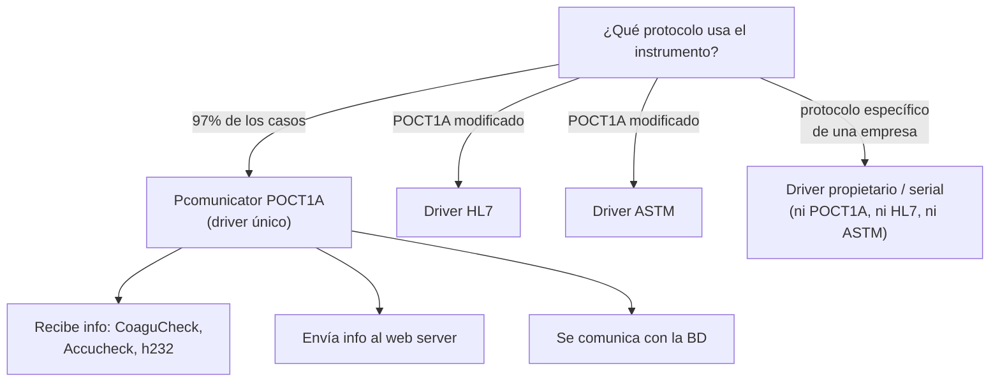
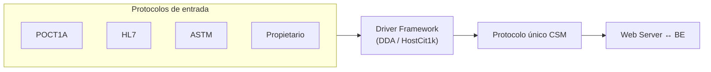
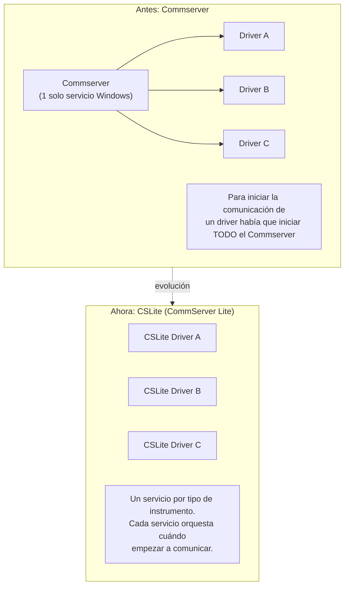
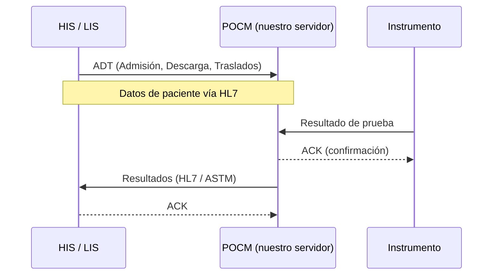

# Arquitectura de Comunicación CSM

> **Concepto clave:** Comunicación **bidireccional** — nuestro servidor recibe los resultados del instrumento **y envía un ACK** (acuse de recibo) de vuelta para confirmar la recepción.

---

## 1. Visión general del flujo

```mermaid
flowchart LR
    subgraph INST["🩺 Instrumentos médicos"]
        I1["CoaguChek"]
        I2["Accu-Chek"]
        I3["Otros equipos<br/>(h232, etc.)"]
    end

    subgraph DRV["🔌 Capa de Drivers (traductores)"]
        D1["Pcomunicator<br/>POCT1A"]
        D2["Driver HL7"]
        D3["Driver ASTM"]
        D4["Driver propietario<br/>(serial)"]
    end

    subgraph FW["⚙️ Driver Framework"]
        DDA["DDA (nuevo, desde 2024)"]
        HOST["HostCit1k (legacy)"]
    end

    CSM["📦 Protocolo único CSM"]
    WS["🌐 Web Server"]
    BE["🗄️ Backend (BE)"]
    DB[("💾 Base de datos")]

    INST -->|"TCP/IP<br/>(red del cliente)"| DRV
    DRV --> FW
    FW -->|"todo se unifica"| CSM
    CSM --> WS
    WS <-->|"bidireccional + ACK"| BE
    BE --> DB

    subgraph EXT["🏥 Sistemas externos"]
        HIS["HIS<br/>(Hospital Info System)"]
        LIS["LIS"]
        US3["Sistema 3rd party"]
    end

    BE <-->|"HL7 / ASTM"| EXT
```

---

## 2. Componentes explicados

### 2.1 Instrumentos
- Cada instrumento se comunica por **cable de red (TCP/IP)**.
- Viajan por la **red del cliente** hasta el servidor donde está instalado nuestro producto.
- Antes existía comunicación **serial**, pero actualmente **no la usamos**.

### 2.2 Driver = traductor
El driver es el traductor entre el instrumento y nuestro sistema. Sus funciones:

| Función | Descripción |
|---------|-------------|
| Abrir puerto | Abre el puerto de comunicación de cualquier instrumento |
| Recibir | Recibe la comunicación del instrumento (cada uno con su protocolo) |
| Traducir | Convierte la info a un formato que POCM entienda y pueda procesar |
| Empaquetar | Prepara el paquete de info que el **BE** entenderá para procesar los datos |

### 2.3 Tipos de driver según protocolo

- **POCT1A (Pcomunicator):** cubre el **97%** de los casos. Recibe de CoaguCheck, Accu-Chek, h232; envía al web server y a la base de datos.
- **HL7 / ASTM:** drivers para otros instrumentos que **modificaron levemente el POCT1A**. Cambia según cómo esté estructurada la info.
- **Propietario (serial):** protocolo muy específico de una empresa, que no es ni POCT1A, ni HL7, ni ASTM.

### 2.4 Driver Framework → Protocolo único CSM
El framework **transforma la comunicación de todos los protocolos en un único protocolo: CSM**, para que el web server pueda comunicarse con el BE, incluso con equipos diferentes.

#### HostCit1k vs DDA
| Aspecto | HostCit1k (legacy) | DDA (desde 2024) |
|---------|--------------------|------------------|
| Rol | Framework que "escucha" al driver | Adapta la info del driver para pasarla al web server |
| Estado | En proceso de sustitución | Todos los **drivers nuevos** ya salen con DDA |
| Coexistencia | Ambos pueden convivir en el mismo servidor | |
| Base de datos al instalar | Al instalar el driver ya crea las pruebas de test en la BD | **No crea nada** hasta que llega un resultado real del instrumento |

### 2.5 Gestión de servicios: Commserver → CSLite

- **Commserver:** un único servicio de Windows administraba **todos** los drivers. Para comunicar un driver había que arrancar el Commserver completo.
- **CSLite (CommServer Lite):** un servicio **por cada tipo de instrumento**. Cada servicio gestiona y orquesta en qué momento empezar la comunicación → **cada driver con su servicio separado**.

---

## 3. Integración con sistemas externos (HIS / LIS / 3rd party)

La comunicación con sistemas hospitalarios es **bidireccional** y usa mensajería estándar.

| Elemento | Significado |
|----------|-------------|
| **HIS** | Hospital Information System |
| **LIS** | Laboratory Information System |
| **ADT** | Admisión, Descarga (alta), Traslados de pacientes |
| **HL7** | Protocolo de mensajería usado para enviar/recibir |
| **ASTM** | Protocolo alternativo de mensajería |
| **Results** | Resultados que fluyen desde POCM hacia HIS/LIS |
| **ACK** | Acuse de recibo que confirma la recepción del mensaje |

---

## 4. Resumen en una frase

> Cada **instrumento** habla su propio protocolo por TCP/IP → un **driver** lo traduce → el **framework (DDA/HostCit1k)** lo unifica en el **protocolo CSM** → el **web server** lo entrega al **backend** y **base de datos**, confirmando con **ACK** → y se integra con **HIS/LIS** vía **HL7/ASTM**. La gestión de servicios pasó de un **Commserver** monolítico a **CSLite**, con un servicio independiente por instrumento.
